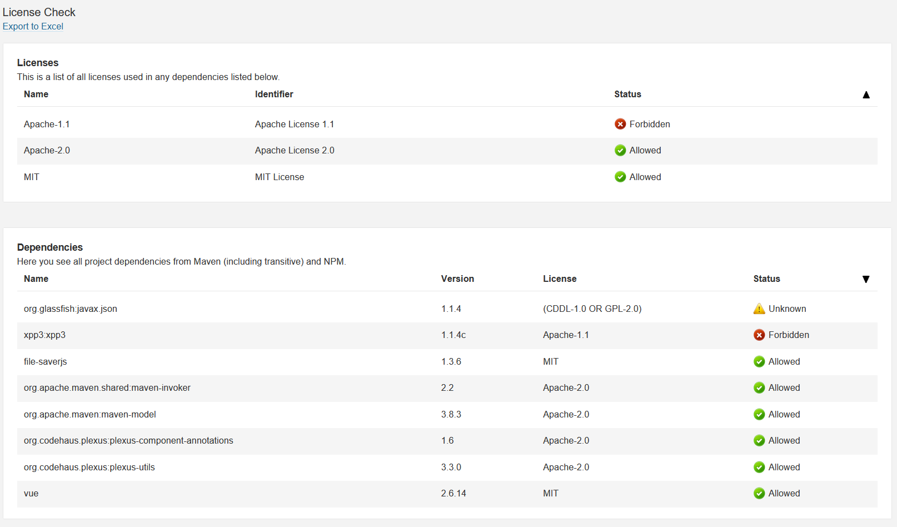
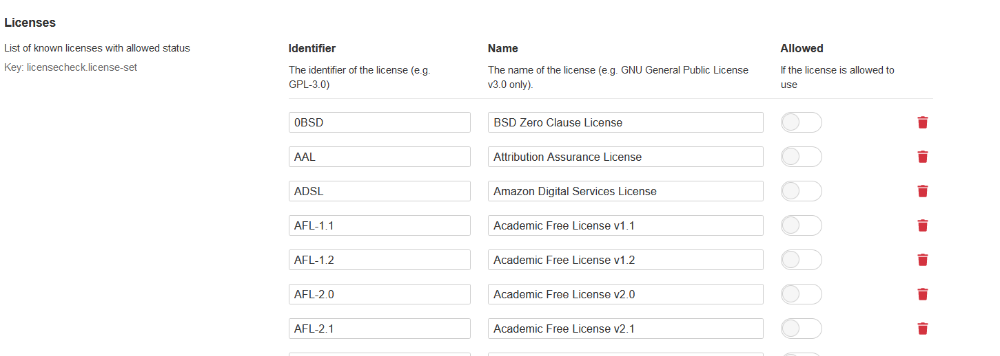
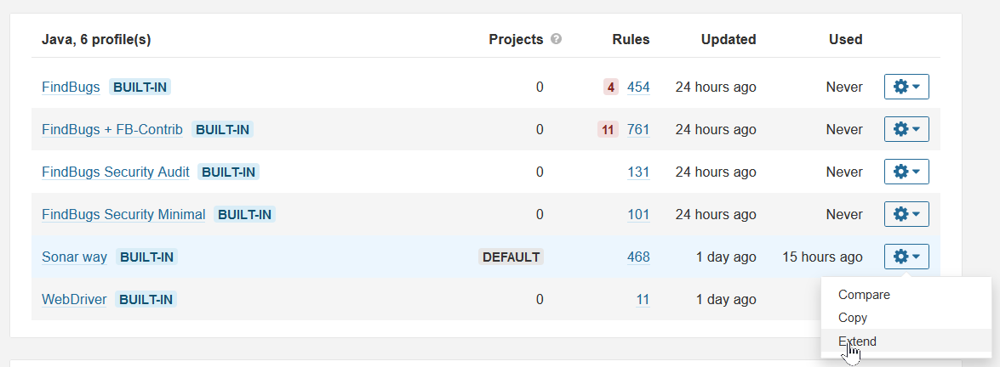
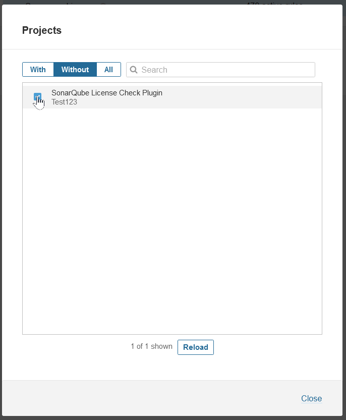

# SonarQube License-Check

This [SonarQube](http://www.sonarqube.org/) plugin ensures that projects use dependencies with compliant licenses. All dependencies and licenses can be viewed per projects and exported to Excel 2003 XML Format. This enables a simple governance of dependencies and licenses for the whole organization.

This fork adds processing of [`license-maven-plugin`-style XML files](https://github.com/mojohaus/license-maven-plugin/blob/master/src/main/resources/org/codehaus/mojo/license/licenses.xsd), instead of forking a new Maven process during Sensor execution.

## License

This software is licensed under the [Apache Software License, Version 2.0](http://www.apache.org/licenses/LICENSE-2.0.txt)

## Table of Contents

<!-- TOC -->

- [Features](#features)
- [Compatibility](#compatibility)
- [Installation](#installation)
- [General Configuration](#configuration)
  - [General Configuration via Administration Tab](#configuration-via-administration-tab)
  - [General Configuration via License Menu](#configuration-via-license-menu)
  - [Activation rules in Quality Profile](#activation-rules-in-quality-profile)
- [Execution](#execution)
- [Supported Languages](#supported-languages)
- [Supported Project Types](#supported-project-types)
  - [Maven](#maven)
  - [NPM](#npm)
  - [Gradle](#gradle)
- [Configuration via Sonar API](#configuration-via-sonar-api)
<!-- TOC -->

## Features

### Analysis

The plugin scans for dependencies defined in your project including all transitive dependencies.

Currently, supported formats are:

- Maven POM files - all dependencies with scope "compile" and "runtime" are checked
- Gradle projects which use JK1 plugin
- NPM package.json files - all dependencies (except "devDependencies") are checked

  - Note that transitive dependencies are _not_ scanned unless `licensecheck.npm.resolvetransitive` is set to `true`.

    

### Project Dashboard

The plugin contains a project dashboard showing a list of dependencies with version and a list of all used licences. Each table shows the status of the license
(allowed, not allowed, not found). You can also export the data to Excel.



## Compatibility

This plugin is compatible:

- 6.x version with 9 LTS (>= 9.5) and 10.x
- 5.x version with 8.9 LTS and < 10 (9.x is compatible)
- 4.x version with SonarQube 8.x

For all changes see [CHANGELOG.md](CHANGELOG.md)

## Installation

Put the pre-built jar-file (from release downloads) in the directory `$SONARQUBE_HOME/extensions/plugins` and
restart the server to install the plugin. Activate the rules of this plugin ("License is not allowed", "Dependency has unknown license") in your SonarQube quality profiles - otherwise the plugin is not executed.

## Configuration

After booting the SonarQube Server with the License-Check Plugin be found in the tab <b>Administration</b> or also in the <b>Configuration -> LicenseCheck</b> drop down menu.

### Configuration via Administration Tab

- Within the <b>General Settings</b> and <b>License Check</b> you find the settings for the plugin.
- Within the general settings the plugin can be manually enabled or disabled. By default, it is enabled.

  - Under "Dependency Mapping" you can map a dependency name/key (with regex) to a license, e.g. `^asm:asm$` to "BSD-3-Clause"
  - Under "License Mapping" you can map a license name (with regex) to a license, e.g. `.*Apache.*2.*` to "Apache-2.0".

    

  - Under "Licenses" you can allow or disallow licenses globally and add/edit the list of known licenses.

    

  - Under "Project Licenses" you can allow and disallow licenses for a specific project.

    

### Configuration via License Menu

Administration -> Configuration(dropdown) -> License Check


- Under "Licenses" you can allow or disallow licenses globally and add/edit the list of known licenses.

  

  

- Under "Project Licenses" you can allow and disallow licenses for a specific project.

  

  

- Under "Dependency Mapping" you can map a dependency name/key (with regex) to a license, e.g. `^asm:asm$` to "BSD-3-Clause"

  

  

- Under "License Mappings" you can map a license name (with regex) to a license, e.g. `.*Apache.*2.*` to "Apache-2.0".

  

  

### Activation rules in Quality Profile

You have to activate the new rules in a (new) quality profile, for each supported language (Groovy, Kotlin, Java, JavaScript, TypeScript) And you have to use this profile for your project.

1. Step 1

   

2. Step 2

   

3. Step 3

   

4. Step 4

   

5. Step 5

   

6. Step 6

   

7. Step 7

   

## Execution

When a project is analyzed using the `mvn sonar:sonar` in command line the extension is started automatically.

Please make sure to have all dependencies installed before launching the SonarQube analysis. So your complete build
should look something like this:

    mvn -B org.jacoco:jacoco-maven-plugin:prepare-agent install org.jacoco:jacoco-maven-plugin:report
    mvn -B sonar:sonar

## Supported Languages

Groovy, Kotlin, Java, JavaScript, TypeScript

## Supported Project Types

### Maven + NPM

When using Maven and a Javascript Package Manager, define the `sonar.sources` property to point to the files which contain dependency information.

```xml
...
<properties>
  <sonar.sources>pom.xml,package.json</sonar.sources>
<properties>
...
```

### Maven

Maven works if your project/module has a `pom.xml` on its root level (running with Maven, Gradle or SonarScanner).

### NPM

NPM works if your project/module has a `package.json` on its root level (running with Maven, Gradle or SonarScanner).

### Gradle

Gradle project should use JK1 plugin https://github.com/jk1/Gradle-License-Report

Note: Please check above link for instructions or follow as mentioned below

**Step1:** Update `build.gradle` file with following code for using JK1 plugin

    import com.github.jk1.license.filter.LicenseBundleNormalizer
    import com.github.jk1.license.render.JsonReportRenderer

    plugins {
      id 'com.github.jk1.dependency-license-report' version '1.13'
    }

    licenseReport {
        allowedLicensesFile = new File("$projectDir/src/main/resources/licenses/allowed-licenses.json")
        renderers = new JsonReportRenderer('license-details.json', false)
        filters = [new LicenseBundleNormalizer()]
    }

**Step 2:** Update `build.gradle` file with following code for using SonarQube plugin

    plugins {
        id 'org.sonarqube' version "3.0"
    }

    jar {
        enabled = true
    }

    sonarqube {
        properties {
            property "sonar.host.url", "http://localhost:9000"
        }
    }

**Step 3:** run following command to generate your report `license-details.json` in `build/reports/dependency-license`

    > gradle generateLicenseReport

**Step 4:** run following command for SonarQube

    > gradle sonarqube

### Configuration via Sonar API

You can also use the [Sonar API](https://docs.sonarqube.org/latest/extend/web-api/) to configure the plugin.

#### Plugin Activation

- Get the setting

  ```
  curl -X GET -v -u USERNAME:PASSWORD "http://localhost:9000/api/settings/values?keys=licensecheck.activation"
  ```

- Enable

  ```
  curl -X POST -v -u USERNAME:PASSWORD "http://localhost:9000/api/settings/set?key=licensecheck.activation&value=true"
  ```

- Disable
  ```
  curl -X POST -v -u USERNAME:PASSWORD "http://localhost:9000/api/settings/set?key=licensecheck.activation&value=false"
  ```

#### Global License Settings

- Get the setting
  ```
  curl -X GET -v -u USERNAME:PASSWORD "http://localhost:9000/api/settings/values?keys=licensecheck.license-set"
  ```

#### Project License Settings

- Get the setting

```
curl -X GET -v -u USERNAME:PASSWORD "http://localhost:9000/api/settings/values?keys=licensecheck.project-license-set"
```

#### License Mapping

- Get the setting

  ```
  curl -X GET -v -u USERNAME:PASSWORD "http://localhost:9000/api/settings/values?keys=licensecheck.license-mapping"
  ```

#### Dependency Mapping

- Get the setting

  ```
  curl -X GET -v -u USERNAME:PASSWORD "http://localhost:9000/api/settings/values?keys=licensecheck.dep-mapping"
  ```

#### NPM Transitive setting

- Get the setting

  ```
  curl -X GET -v -u USERNAME:PASSWORD "http://localhost:9000/api/settings/values?keys=licensecheck.npm.resolvetransitive"
  ```

- Enable

  ```
  curl -X POST -v -u USERNAME:PASSWORD "http://localhost:9000/api/settings/set?key=licensecheck.npm.resolvetransitive&value=true"
  ```

- Disable

  ```
  curl -X POST -v -u USERNAME:PASSWORD "http://localhost:9000/api/settings/set?key=licensecheck.npm.resolvetransitive&value=false"
  ```
